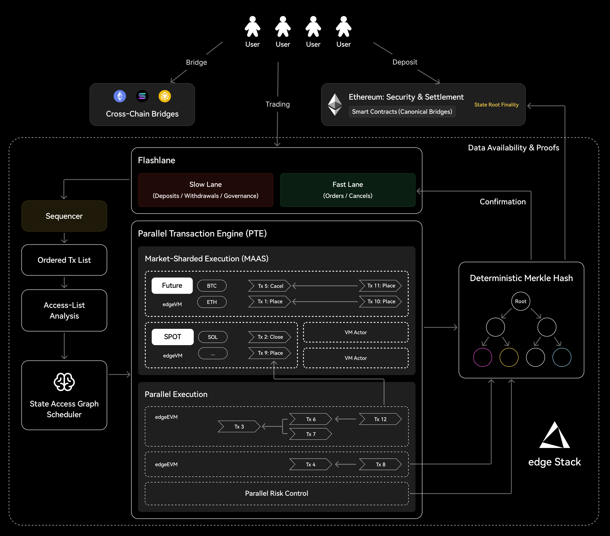

# About edgeX

## edge Stack: Deterministic Parallel and Modular Execution for Trading Engine

### Background: Structural Contradictions in DeFi Infrastructure

Decentralized Finance has evolved quickly, but perpetual futures still face fundamental constraints: slow execution, trust assumptions, and poor scalability. Most chains continue to run transactions through sequential execution over a single global state machine, creating a bottleneck where throughput and latency can’t meet ultra-low-latency demands of high-frequency and quantitative trading. Some systems improved speed but compromised on fairness, transparency, or fully verifiable order matching. Meanwhile, monolithic DEX designs struggle to scale, hosting both perpetuals and broader DeFi functionality becomes costly, rigid, and difficult to expand.

### edge Stack: App-Specific Rollup on Ethereum

edge Stack is built as an App-Specific Execution Layer optimized for high-performance on-chain trading. Instead of adapting generic blockchain infrastructure, we redesign the system at the execution layer. With a modular multi-VM architecture and a deterministic Parallel Transaction Execution (PTE), edge Stack delivers high throughput, low latency, and fully verifiable matching for complex derivatives like perpetuals. As part of the rollup ecosystem, edge Stack ultimately benefits from Ethereum's security guarantees, allowing users to adhere to DeFi's trust minimization principles while enjoying an ultra-low-latency on-chain experience.\

### Three Core Technical Pillars

edge Stack uses a modular Multi-VM architecture optimized for trading workloads.

* **Modular Multi-VM:** Now edgeVM handles perp execution and edgeEVM supports standard DeFi logic. In the future, edgeX can add additional VM environments.
* **Parallel Transaction Execution (PTE):** Executes non-conflicting transactions in parallel.
* **FlashLane**: Quality of Service (QoS) scheduling and multi-lane execution.

<figure><figcaption></figcaption></figure>

#### I. Modular Multi-VM

Core perpetual logic runs inside a dedicated edgeVM with exclusive compute resources for lower latency. Right now it contains:

* **edgeVM** handles high-performance perpetual execution (matching, liquidation, risk).
* **edgeEVM** supports standard DeFi logic such as asset issuance and governance.
* **Precompiled Contracts** run stable but computationally heavy functions.

New product lines can be added by deploying additional VM actors or reusing existing ones, with isolation enforced via EIP-2930–style access lists. This enables plug-and-play expansion without architectural disruption.\

#### II. Deterministic Parallel Transaction Execution (PTE)

PTE is the parallelization engine that transforms the Sequencer’s serial input into safe, verifiable parallel execution.Using Market-Sharded Execution, each market or derivative type is handled by an independent VM Actor, allowing order books and position states to run in parallel without conflict. Highly active markets can be further subdivided, allowing throughput to scale roughly linearly with the number of active markets.Within a market, PTE uses extended access lists to define read/write scopes and only executes non-conflicting transactions in parallel. Conflicts follow fixed resolution rules, ensuring the final state remains serializable to the sequencer’s canonical order. This maintains replayability, auditability, and proof correctness while fully utilizing multi-core compute.Critical subsystems such as liquidation or risk can run as separate Actors and scale horizontally as load grows.\

#### III. FlashLane

On top of raw throughput, edge Stack improves trading UX with QoS scheduling and multi-lane execution.Transactions are routed into two lanes:

* **Fast Lane:** latency-sensitive actions like order placement/cancellation.
* **Slow Lane:** non-urgent operations such as withdrawals or governance.

This prevents non-critical activity from degrading matching engine performance.For high-frequency users, a FlashLane Commitment mechanism provides near-instant soft confirmation. After submission, the system performs a local PTE simulation and returns the intended batch ID and projected queue position (subject to rare reordering) within milliseconds. Combined with micro-batching and optimized I/O, traders gain predictable execution timing while preserving full on-chain verifiability.\

### State & Security

All parallel execution results converge into a single State Root Commitment. Using **Parallel Merklization**, edge Stack computes state tree hashes concurrently within a block, producing a deterministic State Root and Block Hash.These commitments settle to the underlying rollup layer and inherit Ethereum security. Any participant can independently replay the same transaction batch to verify correctness, ensuring full transparency, verifiability, and Ethereum-grade finality - without compromising performance.

