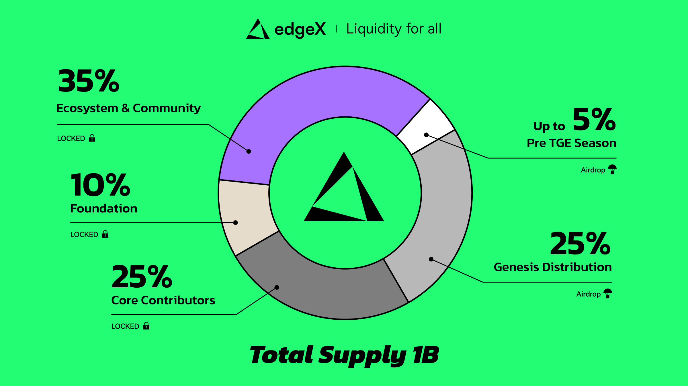

# EDGE

The total supply of EDGE is 1,000,000,000 tokens:

* 25.0% to the genesis distribution
* Up to 5% to the Pre TGE Season
* 25.0% to core contributors
* 10.0% to the Foundation
* 35.0% to future ecosystem and community

<figure><figcaption></figcaption></figure>

\
Tokens allocated to the genesis distribution will be fully unlocked at genesis.

Pre-TGE Season allocation will be fully unlocked 24 hours after the genesis.

Tokens allocated to core contributors will be subject to a 2-year lock-up following genesis, followed by a 2-year vesting schedule.
