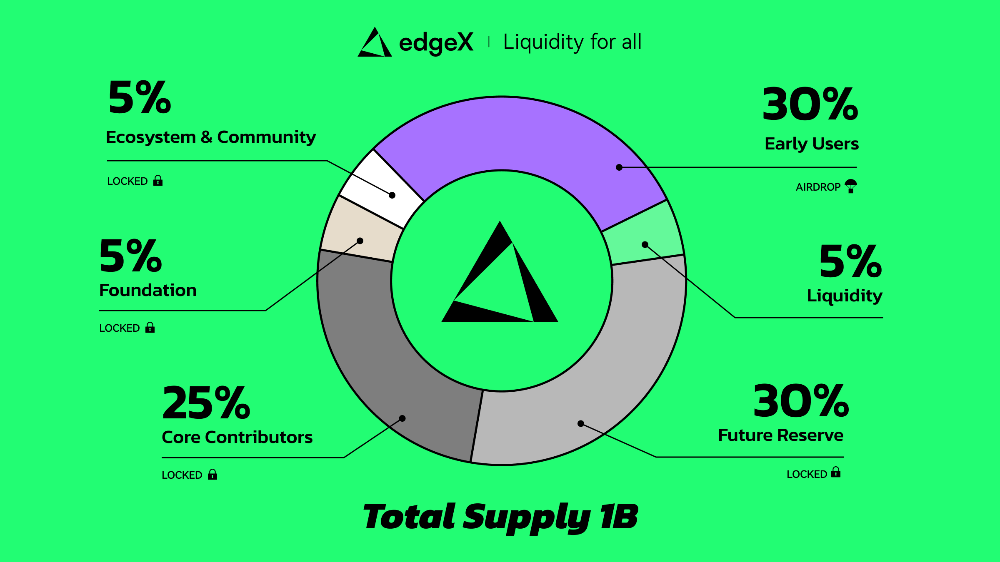

# EDGE

The total supply of EDGE is 1,000,000,000 tokens:

* Early Users: 30% ( 25.0% to the genesis distribution & 5% to the Pre TGE Season )
* Liquidity: 5%&#x20;
* Ecosystem & Community: 5%
* Foundation: 5%
* Future Reserve: 30%
* Core Contributors: 25%

<figure><figcaption></figcaption></figure>

Tokens allocated to the genesis distribution will be fully unlocked at genesis.

Pre-TGE Season allocation will be fully unlocked 24 hours after the genesis.

Ecosystem & Community tokens will remain locked for 12 months after TGE, followed by 24 months of linear monthly vesting.

Foundation tokens will remain locked for 12 months after TGE, followed by 24 months of linear monthly vesting.

Future Reserve tokens will remain locked for 18 months after TGE, followed by 24 months of linear monthly vesting.

Tokens allocated to core contributors will be locked for 24 months after TGE, followed by 24 months of linear monthly vesting.&#x20;
