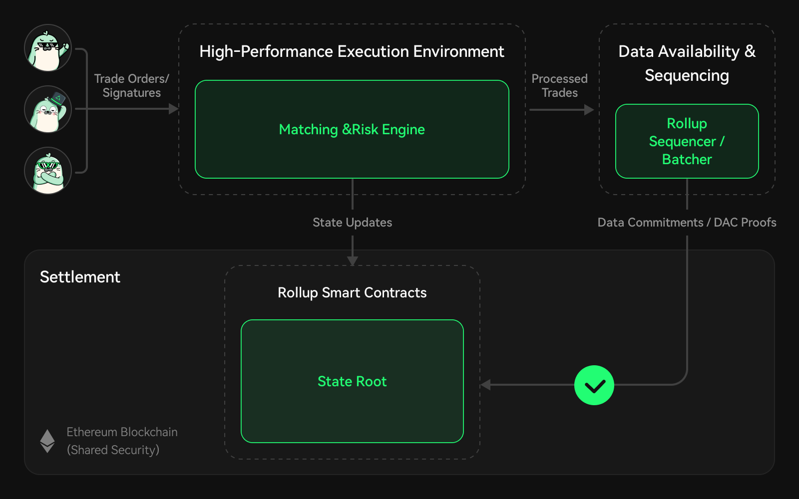

# Self-Custody

edgeX, a high-performance decentralized derivatives trading platform, is committed to advancing user asset security and operational transparency by leveraging a modular Rollup architecture. This integration ensures that users maintain absolute self-custody over their assets while directly benefiting from centralized-exchange-level transaction speeds and drastically reduced costs.

### Leveraging Modular Rollups for Scalability and Security

At the core of the edgeX trading and settlement system is the separation of execution and settlement. The architecture aggregates multiple transactions within a high-performance execution environment and subsequently bridges these states for bulk settlement. This approach significantly reduces the computational load and gas fees, enabling massive throughput without compromising the underlying security guarantees.By adopting this modular technology, edgeX ensures that all asset movements are securely validated and that the final state of balances is transparent, immutable, and anchored to Ethereum's consensus.

<figure><figcaption></figcaption></figure>

<strong>System Operational Flow</strong>

### Overview of Asset Security

1. **Transaction Execution**: Users initiate trades on the edgeX platform, which are instantly matched and processed within the high-performance execution layer.
2. **Batch Processing**: The trading protocol batches these transaction state changes, optimizing the data footprint before pushing it to the settlement layer.
3. **On-Chain Settlement**: The batched states are submitted to the Rollup smart contracts. These contracts enforce rigorous validation checks before any state changes are accepted, cementing the legitimacy of all recorded transactions.

This meticulous process upholds edgeX's security and accuracy, providing users with unwavering confidence in the system's reliability.

### User Asset Self-Custody: Control at the Forefront

Unlike centralized exchanges that hold custody of user funds and pose a single point of failure, edgeX utilizes resilient smart contracts to store and manage assets completely transparently.Users deposit their funds directly into these audited smart contracts before engaging in any trading activities. Crucially, every single transaction or asset movement requires explicit, cryptographic approval through the user's private key (e.g., via EIP-712 signatures). This unyielding requirement guarantees that only the verifiable account owner can authorize the movement of their assets.This non-custodial approach dictates that even while assets are actively managed for trading within the high-speed Rollup environment, the user retains total, unbreakable control. No entity—not even edgeX—can construct fraudulent transactions to misappropriate user assets.

### Anti-Censorship Measures and Uninterrupted Access

The edgeX architecture incorporates robust features to protect user assets through anti-censorship mechanisms, ensuring that users can access their funds without interference at any time:

* **Trustless Withdrawals:** Because edgeX operates on a self-custodial Rollup framework, users are never locked into the operator's interface. Users interact directly with the underlying smart contracts to retrieve their assets.
* **Operator Independence:** Even in extreme black swan scenarios where the edgeX frontend or operator might experience downtime or fail to process requests promptly, users can utilize direct blockchain interactions to verify their balances and execute withdrawals, completely bypassing the operator.

These features ensure that users have uninterrupted, sovereign access to their capital, even in the face of unforeseen market events or platform disruptions.

<figure><figcaption></figcaption></figure>

### Commitment to Transparency and User Empowerment

edgeX's integration of modular Rollup technology represents a significant leap forward in decentralized exchange infrastructure. By prioritizing absolute self-custodial asset security and incorporating unbreakable mechanisms for anti-censorship, edgeX empowers modern traders with unparalleled, institutional-grade control over their portfolios. 
